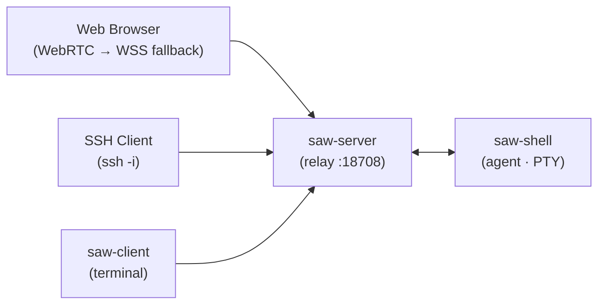

# ShellAnyWhere

English | [中文](README_CN.md)

Terminal sessions that stay alive — pick up from any device.

ShellAnyWhere adds remote access to your local shell. A lightweight agent runs alongside your terminal, and a relay server bridges connections so you can reach it from anywhere. It pairs well with overlay networks like ZeroTier and Tailscale.

Unlike SSH, sessions survive disconnects — reconnect from any device and resume exactly where you left off. Local and remote screens stay in sync, with local terminal taking priority. No workflow changes required. Works with any terminal tool: Claude Code, Codex, vim, htop, or anything else.

How it works: the agent replaces your login shell via RC config, intercepts the PTY's input and output, and relays them through the server — giving any shell or tool real-time remote access with zero adaptation.

## Features

- **Sessions stay alive** — Close your laptop, open your phone, everything is still there
- **Local and remote in sync** — Terminal content syncs in real time; local terminal has priority
- **Works with any tool** — Claude Code, Codex, vim, htop... anything in a terminal, no adaptation needed
- **Mobile access** — Open a browser, no app needed
- **Multi-device** — Browser, SSH, or terminal client, all connect to the same live session
- **Session sharing** — Others can watch your terminal in real time
- **Quick setup** — `saw-server install` + `saw-shell install`, that's it
- **Secure** — TLS encryption, token auth, self-signed certs auto-generated
- **Cross-platform** — Windows, Linux, macOS; installs as user-level service (no root needed on Linux/macOS)

## Demo


https://github.com/user-attachments/assets/a8cea640-df81-4bbd-bcc5-cf9d4dac8ba0

## Quick Start

### 1. Install server

Download the latest release for your platform from [Releases](https://github.com/ejfkdev/ShellAnyWhere/releases), then install as a background service:

```bash
saw-server install          # All platforms: no root/admin needed
```

### 2. Configure the shell agent

Download `saw-shell` and write the connection config into shell RC files:

```bash
saw-shell install
```

Then **open a new shell** for the config to take effect. The new shell will automatically connect to the server.

### 3. Access the remote shell

The server auto-generates a token on first run. View it at:

- Linux/macOS: `cat ~/.config/ShellAnyWhere/token`
- Windows: `type %LOCALAPPDATA%\ShellAnyWhere\token`

**Web browser** (including mobile) — open `https://<server-ip>:18708`, enter the token when prompted.

**Terminal client:**
```bash
saw-client --server <server-address> --token <token>
```

**SSH:**

First, generate the SSH private key derived from your token:
```bash
saw-client ssh-key --server <server-address> --token <token>
```

This saves a private key to `~/.ssh/saw_<host>-<port>_<id>` and prints the usage command, e.g.:
```bash
ssh -i ~/.ssh/saw_my-server-18708_a1b2c3d4 -p 18708 my-server
```

### What you get

Say your computer IP is `192.168.100.100` and saw-server runs on it. You open Ghostty (or any terminal) as usual, run `claude` or `codex` — everything works exactly the same. When you step away, open `https://192.168.100.100:18708` on your phone, and you see the exact same terminal, fully interactive, ready to continue.

## Build from Source

Prerequisites: Rust 1.85+, Node.js 20+

```bash
# Build web frontend first (required for server)
cd web && npm ci && npm run build && cd ..

# Build all binaries
cargo build --release
```

Binaries are in `target/release/`: `saw-server`, `saw-shell`, `saw-client`

## Architecture



- **saw-server** — Relay server. Accepts connections from agents and clients via WebSocket, SSH, and optionally WebRTC/QUIC. Embeds a web terminal UI.
- **saw-shell** — Shell agent. Runs on the remote machine, spawns a PTY, and connects to the server.
- **saw-client** — Local terminal client. Connects to the server to attach to a remote shell session.

## Components

### saw-server

```bash
saw-server                                    # Start with defaults (0.0.0.0:18708)
saw-server -l 0.0.0.0:9000                   # Custom listen port
saw-server -t my-secret-token                  # Set auth token
saw-server --no-ssh                            # Disable SSH
saw-server --cert-file /path/cert \
            --key-file /path/key               # Enable TLS
saw-server install                             # Install as system service
saw-server uninstall                           # Uninstall system service
```

#### Service install

`saw-server install` registers saw-server as a background service that starts on boot and auto-restarts on crash:

| Platform | Mechanism | Privileges |
|----------|-----------|------------|
| Linux | systemd (user) | `saw-server install` |
| macOS | launchd (user) | `saw-server install` |
| Windows | Windows Service | Run as Administrator |

### saw-shell

```bash
saw-shell -s my.server:18708 -t abc123         # Connect to server
saw-shell --io-compress                        # Enable lz4 compression
saw-shell --io-diff                            # Enable fullscreen diff optimization
saw-shell install -s my.server:18708 -t abc      # Write config into shell RC files
saw-shell uninstall                               # Remove config from shell RC files
```

### saw-client

```bash
saw-client --server my.server:18708 --token abc123   # Connect
saw-client --list --token abc123                      # List sessions
saw-client --observe --token abc123                   # Read-only mode
saw-client ssh-key --server my.server:18708 --token abc123  # Derive SSH key
```

## Configuration

Config priority: **CLI args > SAW\_ environment variables > config file > defaults**

Config file locations:
- Linux/macOS: `~/.config/ShellAnyWhere/`
- Logs: Linux `~/.local/state/ShellAnyWhere/`, macOS `~/Library/Logs/ShellAnyWhere/`

Key environment variables:

| Variable | Description |
|----------|-------------|
| `SAW_SERVER` | Server address (agent & client) |
| `SAW_TOKEN` | Authentication token |
| `SAW_LISTEN` | Server listen address |
| `SAW_SHELL_PATH` | Shell program path (agent) |
| `SAW_FOCUS_TRACKING` | Enable focus tracking |
| `SAW_IO_COMPRESS` | Enable lz4 output compression |
| `SAW_IO_DIFF` | Enable diff optimization |
| `SAW_CERT_FILE` | TLS certificate path |
| `SAW_KEY_FILE` | TLS private key path |
| `SAW_SSH_ENABLED` | Enable SSH protocol |
| `SAW_SSH_PASSWORD_AUTH` | Enable SSH password auth |
| `SAW_DATA_DIR` | Data directory |

See [config.toml](config.toml) for the full configuration reference with all options and defaults.

## Project Structure

```
├── crates/
│   ├── core/       # Shared library (config, crypto, protocol, transport)
│   ├── server/     # Relay server
│   ├── shell/      # Shell agent
│   └── client/     # Terminal client
├── web/            # Web frontend (React + Vite + WASM terminal)
├── config.toml     # Default configuration (embedded in binary)
└── LICENSE         # MPL-2.0
```

## License

[MPL-2.0](LICENSE)
