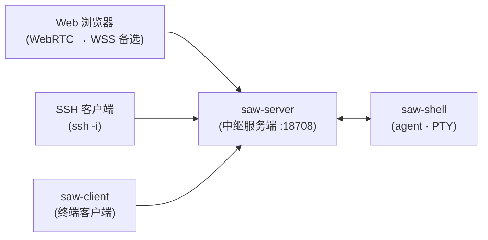

# ShellAnyWhere

[English](README.md) | 中文

终端会话持续在线 — 随时从任何设备继续。

ShellAnyWhere 为本地 Shell 添加远程访问能力。一个轻量 agent 运行在终端旁，服务端中转连接，让你从任何地方都能访问。配合 ZeroTier、Tailscale 等异地组网工具使用效果更佳。

和 SSH 不同，断开连接后会话仍然存活——从任意设备重连即可恢复现场。本地与远程屏幕同步，本地终端优先，无需改变使用习惯。兼容任何终端工具：Claude Code、Codex、vim、htop，都可以。

实现原理：agent 通过 RC 配置替换登录 shell，截获 PTY 的输入输出并经服务端中转——从而让任意 shell 和命令工具获得实时远程同步能力，无需任何适配。

## 功能特性

- **会话持续在线** — 关掉电脑，打开手机，会话还在运行
- **本地远程同步** — 终端内容实时同步，本地终端优先
- **任意工具兼容** — Claude Code、Codex、vim、htop……终端里的工具都能用，无需适配
- **手机访问** — 浏览器打开即可，无需安装应用
- **多端接入** — 浏览器、SSH、终端客户端，连接同一个活跃会话
- **会话共享** — 他人可实时观察你的终端
- **快速部署** — `saw-server install` + `saw-shell install`，即可使用
- **内置安全** — TLS 加密、Token 认证、自签证书自动生成
- **跨平台** — Windows、Linux、macOS；Linux/macOS 无需 root 安装为用户级服务

## 演示


https://github.com/user-attachments/assets/197e9688-e472-439b-a551-760cf281519b

## 快速开始

### 1. 安装 saw 服务端

macOS 可通过 `brew install ejfkdev/tap/saw` 安装，其他平台从 [Releases](https://github.com/ejfkdev/ShellAnyWhere/releases) 下载。然后安装为后台服务：

```bash
saw-server install
```

### 2. 配置 Shell 代理

下载 `saw-shell`，将连接配置写入 shell RC 文件：

```bash
saw-shell install
```

然后**打开一个新的 shell** 使配置生效。新 shell 会自动连接到 saw 服务端。

### 3. 访问远程 Shell

saw 服务端首次运行时自动生成 token，查看方式：

- Linux/macOS：`cat ~/.config/ShellAnyWhere/token`
- Windows：`type %LOCALAPPDATA%\ShellAnyWhere\token`

**Web 浏览器**（支持手机访问） — 打开 `https://<saw服务端IP>:18708`，输入 token 即可。

**终端客户端：**
```bash
saw-client --server <saw服务端地址> --token <token>
```

**SSH：**

首先，从 token 派生 SSH 私钥：
```bash
saw-client ssh-key --server <saw服务端地址> --token <token>
```

这会将私钥保存到 `~/.ssh/saw_<host>-<port>_<id>`，并打印使用命令，例如：
```bash
ssh -i ~/.ssh/saw_my-server-18708_a1b2c3d4 -p 18708 my-server
```

### 最终效果

假设你的电脑 IP 是 `192.168.100.100`，saw-server 就装在这台电脑上。你照常打开 Ghostty（或任何终端），运行 `claude` 或 `codex` —— 和以前完全一样。离开时，手机浏览器打开 `https://192.168.100.100:18708`，看到的是完全相同的终端画面，完整交互，随时继续。

## 从源码构建

前置条件：Rust 1.85+、Node.js 20+

```bash
# 先构建 Web 前端（server 编译需要）
cd web && npm ci && npm run build && cd ..

# 构建所有二进制文件
cargo build --release
```

二进制文件位于 `target/release/`：`saw-server`、`saw-shell`、`saw-client`

## 架构



- **saw-server** — 中继服务端。接受来自 agent 和 client 的 WebSocket、SSH 以及可选的 WebRTC/QUIC 连接。内嵌 Web 终端 UI。
- **saw-shell** — Shell 代理。运行在远程机器上，启动 PTY，连接到 saw 服务端。
- **saw-client** — 本地终端客户端。连接到 saw 服务端以附加到远程 Shell 会话。

## 组件

### saw-server

```bash
saw-server                                    # 默认启动 (0.0.0.0:18708)
saw-server -l 0.0.0.0:9000                   # 自定义监听端口
saw-server -t my-secret-token                  # 设置认证 token
saw-server --no-ssh                            # 禁用 SSH
saw-server --cert-file /path/cert \
            --key-file /path/key               # 启用 TLS
saw-server install                             # 安装为系统服务
saw-server uninstall                           # 卸载系统服务
```

#### 服务安装

`saw-server install` 将 saw-server 注册为后台服务，开机自动启动，崩溃自动重启：

| 平台 | 机制 | 权限要求 |
|------|------|----------|
| Linux | systemd（用户级） | `saw-server install` |
| macOS | launchd（用户级） | `saw-server install` |
| Windows | Windows Service | 以管理员身份运行 |

### saw-shell

```bash
saw-shell -s my.server:18708 -t abc123         # 连接到 saw 服务端
saw-shell --io-compress                        # 启用 lz4 压缩
saw-shell --io-diff                            # 启用全屏差异优化
saw-shell install -s my.server:18708 -t abc      # 将配置写入 shell RC 文件
saw-shell uninstall                               # 从 shell RC 文件中移除配置
```

### saw-client

```bash
saw-client --server my.server:18708 --token abc123   # 连接
saw-client --list --token abc123                      # 列出会话
saw-client --observe --token abc123                   # 只读模式
saw-client ssh-key --server my.server:18708 --token abc123  # 派生 SSH 密钥
```

## 配置

配置优先级：**命令行参数 > SAW\_ 环境变量 > 配置文件 > 默认值**

配置文件路径：
- Linux/macOS：`~/.config/ShellAnyWhere/`
- 日志：Linux `~/.local/state/ShellAnyWhere/`，macOS `~/Library/Logs/ShellAnyWhere/`

主要环境变量：

| 变量 | 说明 |
|------|------|
| `SAW_SERVER` | saw 服务端地址（agent 和 client） |
| `SAW_TOKEN` | 认证 token |
| `SAW_LISTEN` | saw 服务端监听地址 |
| `SAW_SHELL_PATH` | Shell 程序路径（agent） |
| `SAW_FOCUS_TRACKING` | 启用焦点追踪 |
| `SAW_IO_COMPRESS` | 启用 lz4 输出压缩 |
| `SAW_IO_DIFF` | 启用差异优化 |
| `SAW_CERT_FILE` | TLS 证书路径 |
| `SAW_KEY_FILE` | TLS 私钥路径 |
| `SAW_SSH_ENABLED` | 启用 SSH 协议 |
| `SAW_SSH_PASSWORD_AUTH` | 启用 SSH 密码认证 |
| `SAW_DATA_DIR` | 数据目录 |

完整配置参考见 [config.toml](config.toml)。

## 项目结构

```
├── crates/
│   ├── core/       # 共享库（配置、加密、协议、传输）
│   ├── server/     # 中继服务端
│   ├── shell/      # Shell 代理
│   └── client/     # 终端客户端
├── web/            # Web 前端（React + Vite + WASM 终端）
├── config.toml     # 默认配置（内嵌到二进制中）
└── LICENSE         # MPL-2.0
```

## 许可证

[MPL-2.0](LICENSE)
